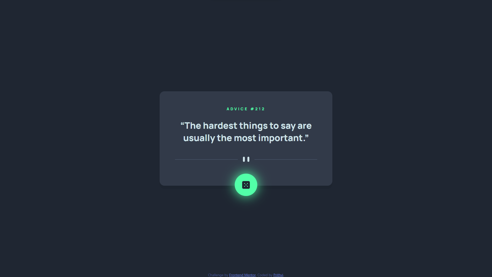
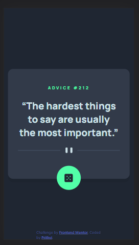

# Frontend Mentor - Advice generator app

This is a solution to the [Advice generator app challenge on Frontend Mentor](https://www.frontendmentor.io/challenges/advice-generator-app-QdUG-13db).

## Table of contents

- [Overview](#overview)
  - [Screenshot](#screenshot)
  - [Links](#links)
- [Author](#author)
- [Acknowledgments](#acknowledgments)

## Overview

This project is done using HTML, CSS and ReactJS library. The main aim was to replicate the given design as close as possible and make it mobile responsive too.

### Screenshot

- Desktop View
   
- Mobile View 
  

### Links

- Solution URL: [Solution URL](https://github.com/Prithvi12890/frontend-mentor-challenges/tree/master/advice-generator-app)
- Live Site URL: [Live site](https://prithvi12890.github.io/advice-generator-app/)

## Author

- Frontend Mentor - [@Prithvi12890](https://www.frontendmentor.io/profile/Prithvi12890)
