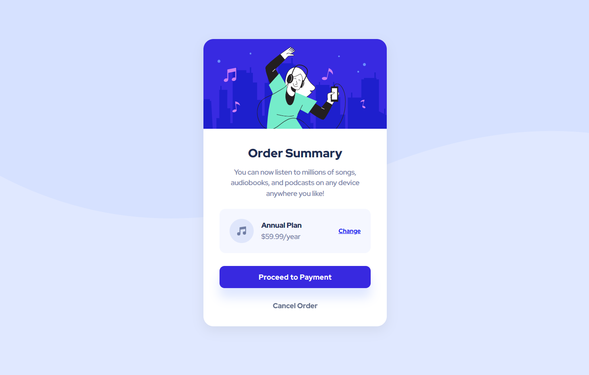

# Frontend Mentor - Order summary card solution

This is a solution to the [Order summary card challenge on Frontend Mentor](https://www.frontendmentor.io/challenges/order-summary-component-QlPmajDUj). 

## Table of contents

- [Overview](#overview)
  - [Screenshot](#screenshot)
  - [Links](#links)
- [Author](#author)
- [Acknowledgments](#acknowledgments)

## Overview
This project is done using basic HTML and CSS. The main aim was to replicate the given design as close as possible and make it mobile responsive too.

### Screenshot
- Desktop View
 
- Mobile View 

### Links

- Solution URL: [Solution URL](https://github.com/Prithvi12890/frontend-mentor-challenges/tree/master/order-summary-component)
- Live Site URL: [Live site](https://prithvi12890.github.io/frontend-mentor-challenges/order-summary-component/)

## Author

- Frontend Mentor - [@Prithvi12890](https://www.frontendmentor.io/profile/Prithvi12890)
