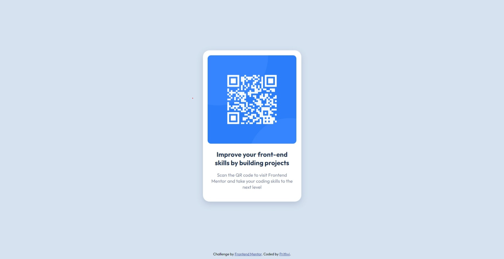

# Frontend Mentor - QR code component solution

This is a solution to the [QR code component challenge on Frontend Mentor](https://www.frontendmentor.io/challenges/qr-code-component-iux_sIO_H).

## Table of contents

- [Overview](#overview)
  - [Screenshot](#screenshot)
  - [Links](#links)
- [Author](#author)
- [Acknowledgments](#acknowledgments)

## Overview
This project is done using basic HTML and CSS. The main aim was to replicate the given design as close as possible and make it mobile responsive too.

### Screenshot
- Desktop View

- Mobile View

### Links

- Solution URL: [Solution URL](https://github.com/Prithvi12890/frontend-mentor-challenges/qr-code-component/)
- Live Site URL: [Live site](https://prithvi12890.github.io/frontend-mentor-challenges/qr-code-component/)

## Author

- Frontend Mentor - [@Prithvi12890](https://www.frontendmentor.io/profile/Prithvi12890)

## Acknowledgments

Thank you <a href="https://www.frontendmentor.io/profile/Chaitanya-087">Chaitanya</a> for helping me out through the project, giving me tips on best practices and suggesting better ways.
